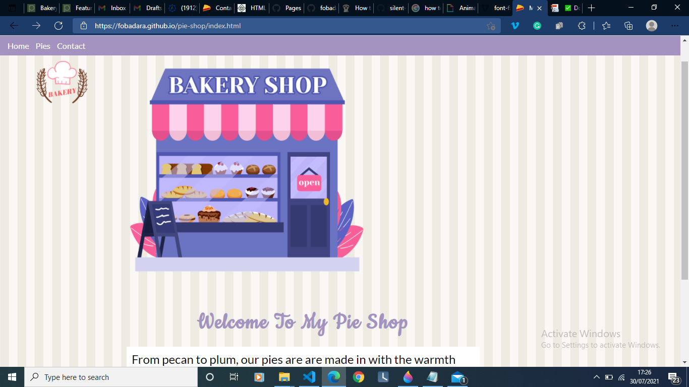
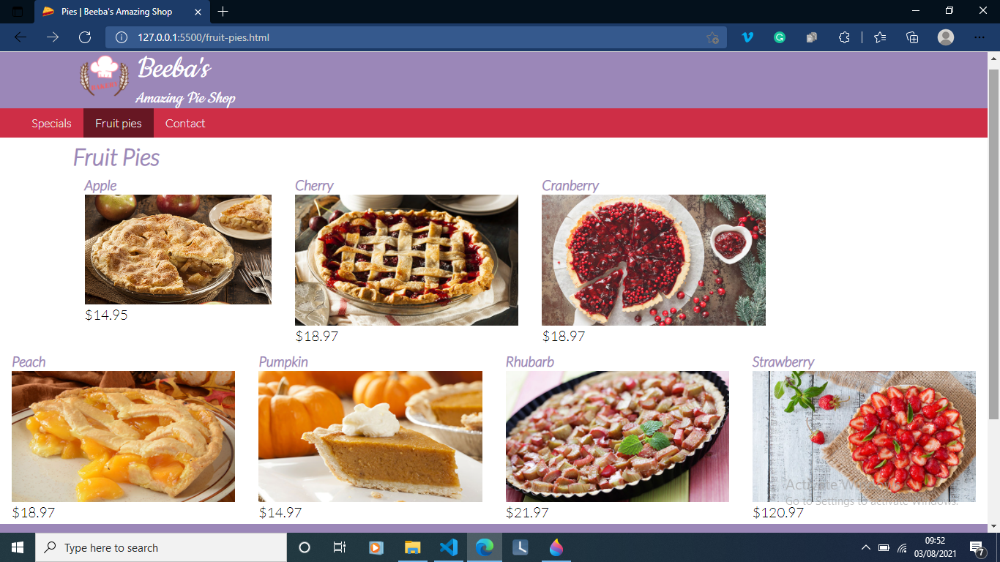
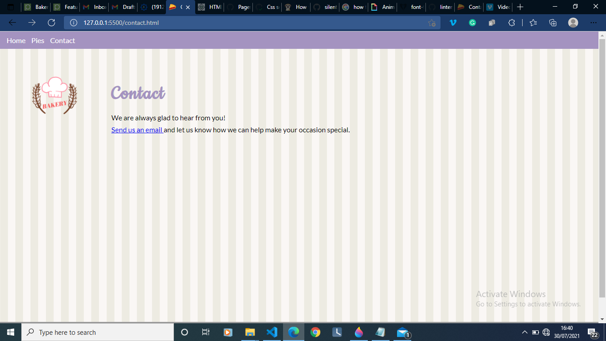

# Beebas Amazing pie shop

A site that takes your orders and gets your location (with your permission ofcourse). Built with HTML, CSS, Javascript, SASS and Bootstrap

<a href="https://fobadara.github.io/beebas-pie-shop-gallery" text="bold">Live Demo</a>

# Description

This imaginary site shows some of beeba's best pies and how to get across to her. This site is fully responsive and compatible to all screen sizes and all device. No flexbox was used nor was the grid system applied. Also the site includes wayfinding so you can never get lost.

# Built With

● HTML

● CSS

● Javascript

● HTML and CSS Linters

● SASS

# Getting Started

To get a local copy up and running follow these simple example steps.

⬜ clone the app by running this command `git clone https://github.com/fobadara/beebas-pie-shop-gallery`

⬜ Run this command `cd beebas-pie-shop-gallery`

⬜ Open in browser

# Prerequisites

You will be needing:

⬜ A web browser to view output

⬜ A text editor or terminal

# Run tests

You can run tests by following these steps:

⬜ commit and push your changes

⬜ navigate to pull request

⬜ I have created a pull request which runs linters or you could simply create a pull request of your own

# Authors

👤 Abdulfatai Badara

GitHub: [https://github.com/fobadara](https://github.com/fobadara)

Twitter: fob90s@twitter.com

🤝 **Contributing**

Contributions, issues, and feature requests are welcome!

Feel free to check the issues page.

# Show your support

Give a ⭐️ if you like this project!

# Acknowledgments

Hat tip to anyone whose code was used

A big thank you to pngtree whose images have been used:

⬜ purple PNG Designed By CHENXIN from https://pngtree.com/freepng/purple-bakery-clip-art_5894548.html?sol=downref&id=bef

⬜ features PNG Designed By CHENXIN from https://pngtree.com/freepng/featured-orange-bakery-clip-art_5894553.html?sol=downref&id=bef

Lots of appreciations to my wife, Habeebah who keeps supporting me

📝 **License**

This project is licensed by [MIT](LICENSE)
